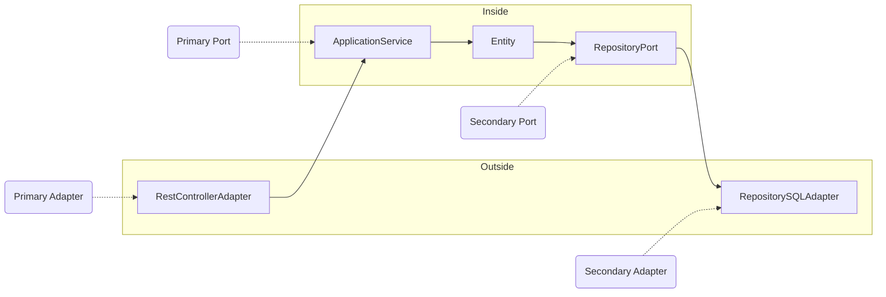
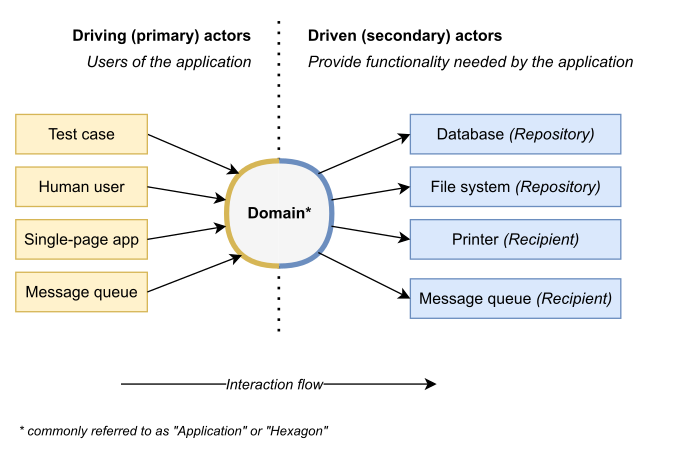

# thin-ports-and-adapters

[](https://github.com/aleixmorgadas/thin-ports-and-adapters/discussions)

### [¡Comparte tus puertos y adaptadores ligeros en otro idioma o framework aquí! 🙌](https://github.com/aleixmorgadas/thin-ports-and-adapters/discussions/categories/thin-p-a-in-other-languages-and-frameworks)

Este es un ejemplo de una arquitectura de Puertos y Adaptadores (P&A, por sus siglas en inglés) en Java 21 y Spring Boot.

Podemos definir una arquitectura P&A simple de la siguiente manera:




[Referencia](https://codesoapbox.dev/ports-adapters-aka-hexagonal-architecture-explained/)

Una posible implementación en Spring Boot de los adaptadores es:

```java
// RestControllerAdapter (Primary Adapter)
@RestController
class TeamController {
    private final TeamService teamService; // Primary Port
    
    @GetMapping("/teams")
    public List<TeamData> getTeams() {
        return teamService.getTeams();
    }
}

// TeamRepositoryPort (Secondary Port)
interface TeamRepository extends ListCrudRepository<Team, Long> {
}

// The SQL Adapter of the TeamRepositoryPort is provided by Spring Data JPA. It is the Secondary Adapter.
```

### ¿Es solo esto?

Sí, una arquitectura de puertos y adaptadores es solo esto.

Patrones como Eventos de Dominio, Agregados, Objetos de Valor, CQRS y Event Sourcing, todos esos patrones van más allá de la intención o responsabilidad de una arquitectura de puertos y adaptadores. De hecho, una arquitectura P&A funciona bien con modelos CRUD (o modelos con poca lógica de dominio), así como con Modelos de Dominio.

Lo mejor es que se adapta a cada parte de tu negocio, y puedes elegir la cantidad adecuada de abstracción/complexidad para cada escenario.

### ¿Y las pruebas?

En mi opinión, este es el punto donde brilla una arquitectura P&A. Realmente te ayuda a crear un conjunto de pruebas sólido y adaptable. Aquí hay un breve ejemplo de tipos de pruebas.

**Pruebas de extremo a extremo**

- [TeamControllerE2ETest](src/test/java/dev/aleixmorgadas/thinportsandadapters/web/TeamControllerE2ETest.java)

**Pruebas de integración**

- Adaptador HTTP. [TeamControllerIntegrationTest](https://github.com/aleixmorgadas/thin-ports-and-adapters/blob/main/src/test/java/dev/aleixmorgadas/thinportsandadapters/web/TeamControllerIntegrationTest.java)
- Servicio y Repositorio SQL. [TeamServiceIntegrationTest](https://github.com/aleixmorgadas/thin-ports-and-adapters/blob/main/src/test/java/dev/aleixmorgadas/thinportsandadapters/domain/TeamServiceIntegrationTest.java)
- Repositorio SQL. [TeamRepositoryIntegrationTest](https://github.com/aleixmorgadas/thin-ports-and-adapters/blob/main/src/test/java/dev/aleixmorgadas/thinportsandadapters/domain/TeamRepositoryIntegrationTest.java)

**Pruebas unitarias**

- Adaptador HTTP. [TeamControllerUnitTest](https://github.com/aleixmorgadas/thin-ports-and-adapters/blob/main/src/test/java/dev/aleixmorgadas/thinportsandadapters/web/TeamControllerUnitTest.java)
- Servicio. [TeamServiceTest](https://github.com/aleixmorgadas/thin-ports-and-adapters/blob/main/src/test/java/dev/aleixmorgadas/thinportsandadapters/domain/TeamServiceTest.java)
- Dominio. [TeamTest](https://github.com/aleixmorgadas/thin-ports-and-adapters/blob/main/src/test/java/dev/aleixmorgadas/thinportsandadapters/domain/TeamTest.java)

## Ejecutando la aplicación

```shell
./gradlew bootTestRun
```

ℹ️ Utiliza la [integración de Spring Boot][sbit] con Testcontainers para iniciar un contenedor de PostgreSQL.

### Usando la API

```shell
curl -X GET http://localhost:8080/teams
``` 

```shell
curl -X POST -H "Content-Type: application/json" -d '{"name": "Team 1"}' http://localhost:8080/teams
```

```shell
curl -X PATCH -H "Content-Type: application/json" -d '{"name": "Team 1"}' http://localhost:8080/teams/{id}/rename
```

## Ejecutando las pruebas

```shell
./gradlew test
```

Verás cómo la arquitectura de puertos y adaptadores ligeros nos permite probar la aplicación con múltiples enfoques:

- Pruebas unitarias para la lógica de dominio.
- Pruebas de integración para el servicio de aplicación.
- Pruebas de extremo a extremo para la API REST.

[sbit]: https://spring.io/blog/2023/06/23/improved-testcontainers-support-in-spring-boot-3-1
