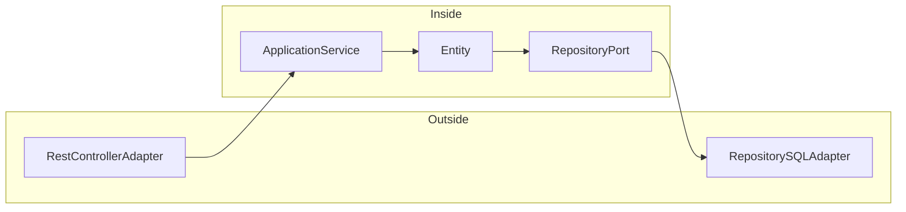

# thin-ports-and-adapters

This is an example of a Ports and Adapters (P&A for short) architecture in Java 21 and Spring Boot.

We can define a simple P&A architecture as follows:



A possible Spring Boot implementation of the adapters is:

```java
// RestControllerAdapter
@RestController
class TeamController {
    private final TeamService teamService;
    
    @GetMapping("/teams")
    public List<TeamData> getTeams() {
        return teamService.getTeams();
    }
}

// TeamRepositoryPort
interface TeamRepository extends ListCrudRepository<Team, Long> {
}

// The SQL Adapter of the TeamRepositoryPort is provided by Spring Data JPA.
```

## Running the application

```shell
./gradlew bootTestRun
```

ℹ️ It uses [Spring Boot integration][sbit] with Testcontainers to spin up a PostgreSQL container.

### Using the API

```shell
curl -X GET http://localhost:8080/teams
``` 

```shell
curl -X POST -H "Content-Type: application/json" -d '{"name": "Team 1"}' http://localhost:8080/teams
```

```shell
curl -X PATCH -H "Content-Type: application/json" -d '{"name": "Team 1"}' http://localhost:8080/teams/{id}/rename
```

## Running the tests

```shell
./gradlew test
```

You will see how the thin ports and adapters architecture allows us to test the application with multiple approaches:

- Unit tests for the domain logic.
- Integration tests for the application service.
- End-to-end tests for the REST API.

[sbit]: https://spring.io/blog/2023/06/23/improved-testcontainers-support-in-spring-boot-3-1
